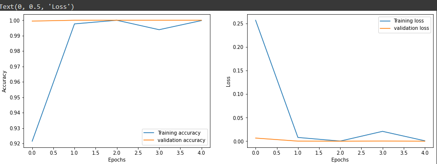

# Sign Language Gesture Prediction

## Introduction

Sign language is used to communicate with people who have problem hearing. The outcome of the project could be used by people to learn sign languages, it could also be used in institutions for teaching. 

## About the dataset:

The dataset contains sign language gesture images of English Alphabets from A-Z, Numbers from 0 - 9 and a Space character - , which in total has 37 different hand gestures. Images are coloured, with an image size of 50 * 50. Images are stored in seperate folder with respective folder names such as A to Z folder has gesture images of alpahbet A to Z , 0-9 folder has images of numbers from 0 to 9 and space(-) folder has images of space that people use to express in sign language and each folder has 1500 images (each gestures has 1500 samples). 

## Data preprocessing

Proceessed the datas using tensorflows preprocessing  

1. Resizing layers- used to change image length and widhth to (256,256)

2. Rescaling layers- to stanadradize the data 

3. RandomZoom layers - to randomly zoom in or out on each axis of an image independently

* Before using data augumentation on the dataset, I have tried to visualisize how it looks with this particular dataset

- Using RandomFlip and RandomRotation layers

* From the visualization it is clear that having a flipped or rotated images changes the meaning of the data. 
For example : The letter "i" when flipped a little towards right looks like "j" in gesture sign language

* However, I have also applied data augumentation in the model and realised the accuracy decreased with data agumentation. Hence using data agumentation is not an good option in this case

* So, I have only used data_preprocessing to build the model

## Model building

Within the sequential layers having 

1. data_preprocessing as the first layer consisting of resizing, rescaling and randomzoom preprocessing layers

2. Secondly having stack of convolutional 2D and Maxpooling layers. In this case, using 4 layers of each ( tried different counts), the convolutional layers take filters to find the features of the images and its size which is given by the kernel_size and an activation function

* The first convolutional layer takes the input shape (256,256,3) which is image height, width and the rgb mode , 32 filters with size of 3* 3 and relu as its activation function. And the following convolutional layers take same kernel size and activation function but the filter value as 64

* Using maxpooling layers as it extracts the main and sharp features from the images providing size of 3 * 3

3. Within the dense network 

* Having a flatten layer, which helps to reduce the dimensionality of the input to single dimension

* Followed by flatten layer having two deep layers where the first layer has 64 neurons and relu as its activation function, and the second is the output layer with 37 output categories and softmax as its activation function since it normalises the output

As CNN layers are used, there is not much necessary to use more dense layers CNN layers itself does the job

Have also tried different optimizer values

Using SparseCategoricalCrossentropy as loss function, since the traget value is not onehotencoded, also setting the from_logits = False as use softmax functione loss is normalised

Using accuracy as the metric to evaluate the model

Have built the model within a function to try different optimizers such as ['Adadelta', 'Adagrad', 'Adam', 'RMSprop', 'SGD']. Since the adam optimizer performs better have considered the same for training

I have tried to train the model with 10 epochs, but the accuracies were consitent even from the third epoch and did not have any change till 10th. So i decided to run only for 5 epochs.

## Evaluating the test data

